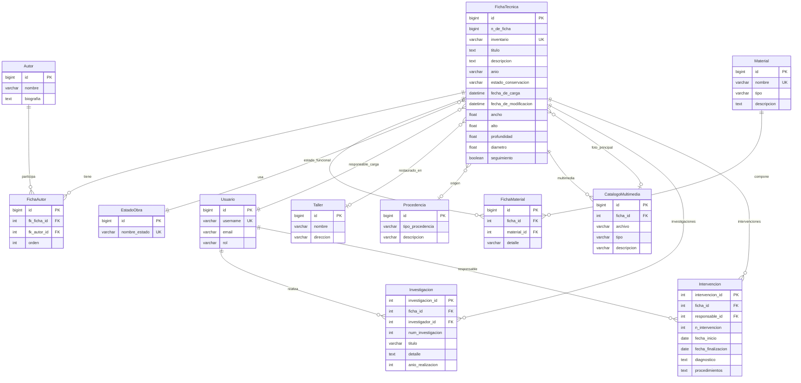
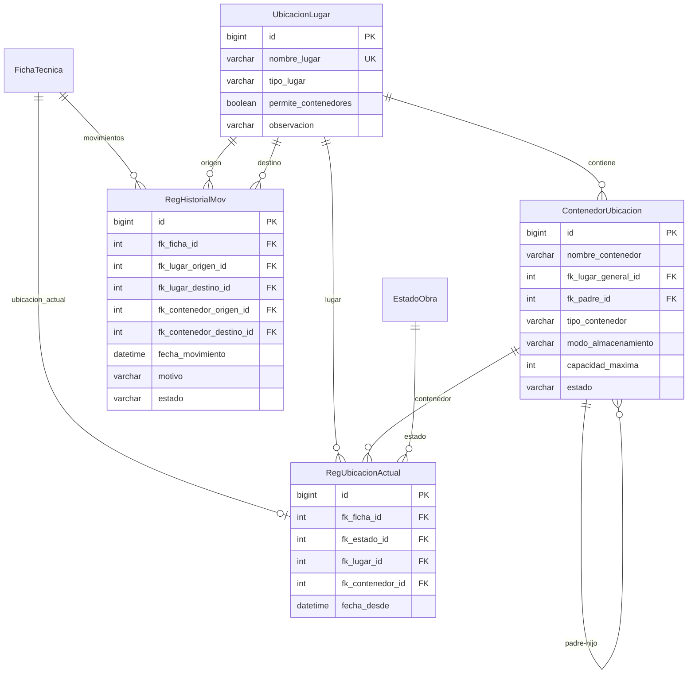
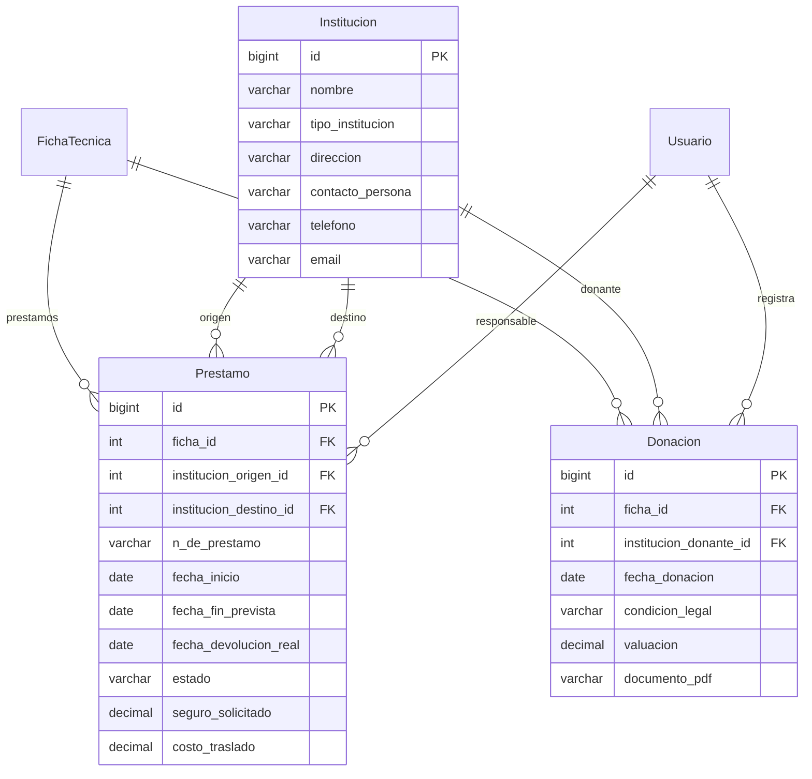
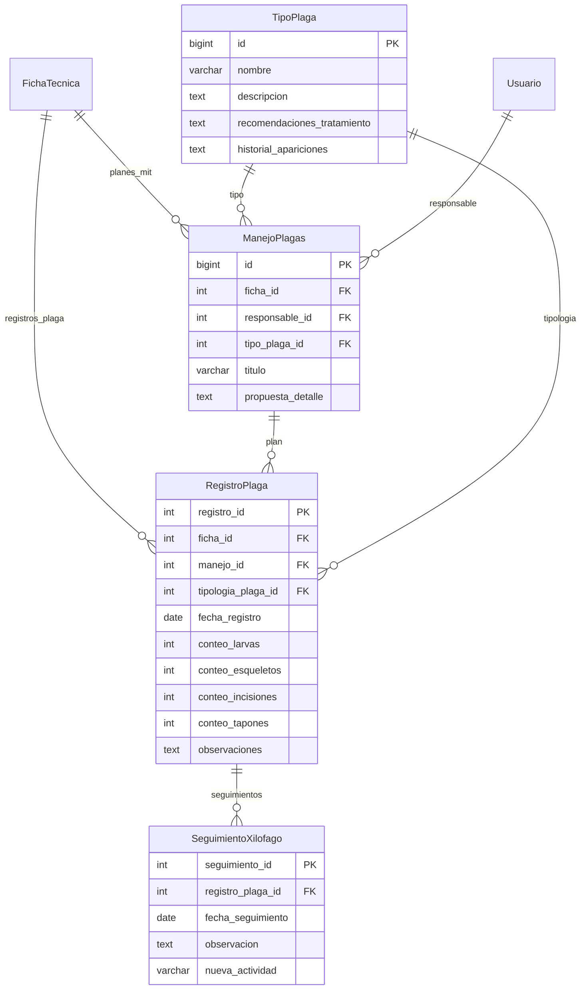

# Diagrama Entidad-Relación (DER)

## Diagrama Principal

## Diagrama de Ubicaciones

## Diagrama de Préstamos y Donaciones

## Diagrama de Control de Plagas

## Resumen de Relaciones

### Tabla Central: FichaTecnica

| Relación | Tipo | Tabla Relacionada |
|----------|------|-------------------|
| autores | M:N | Autor (via FichaAutor) |
| materiales | M:N | Material (via FichaMaterial) |
| estado_funcional | N:1 | EstadoObra |
| responsable_carga | N:1 | Usuario |
| taller | N:1 | Taller |
| procedencia | N:1 | Procedencia |
| multimedia_principal | N:1 | CatalogoMultimedia |
| catalogo_multimedia | 1:N | CatalogoMultimedia |
| investigaciones | 1:N | Investigacion |
| intervenciones | 1:N | Intervencion |
| ubicacion_actual | 1:1 | RegUbicacionActual |
| historial_movimientos | 1:N | RegHistorialMov |
| prestamos | 1:N | Prestamo |
| donaciones | 1:N | Donacion |
| planes_mit | 1:N | ManejoPlagas |
| registros_plaga | 1:N | RegistroPlaga |

### Cardinalidades

- **1:1** - Una ficha tiene una ubicación actual
- **1:N** - Una ficha puede tener múltiples investigaciones, intervenciones, movimientos, etc.
- **M:N** - Autores y materiales se relacionan con fichas mediante tablas intermedias
- **N:1** - Múltiples fichas pueden tener el mismo estado, responsable, taller, etc.

---

*Generado automáticamente - Última actualización: 2024-12*
